# Azure DevOps

VSTS is the ultimate DevOps solution into Azure.  With the new Azure DevOps Project we make it very simple to build your pipeline into Azure. The DevOps Project sets up everything you need for developing, deploying, and monitoring your application.

 In this demo, we're going to see how you can use Azure DevOps Project to automate the setup of an entire Continuous Integration (CI) and Continuous Delivery (CD) pipeline to Azure. 

1. To create an Azure DevOps Project, we go into the Azure portal and create a new resource and choose **DevOps Project**. The first thing you will be asked is what language do you want to use - .NET, Java, Node, PHP, or Python? We can even have static web apps.  Now, for this demo let's go ahead and choose .NET. 

    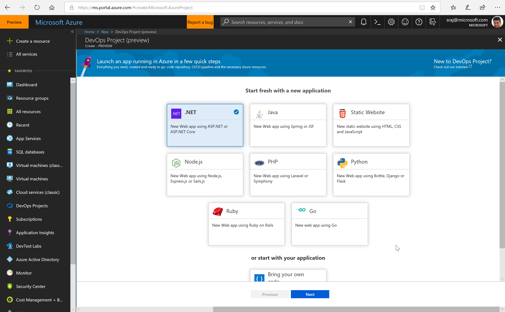

1. Next, it's going to ask you to select the application framework you  want to use. We will select ASP.NET and will also add a database. 

    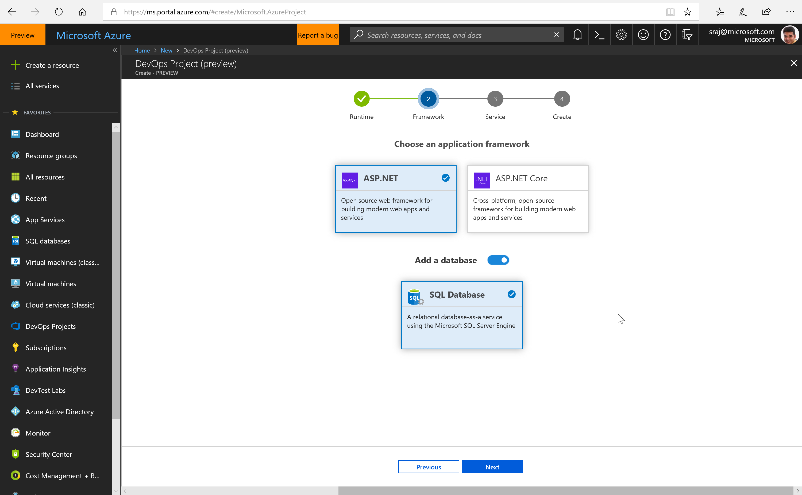

1. Select Next To continue. Next, you will need to choose the type of infrastructure you want to deploy.  Depending on what technology you chose, you can choose any targets such as Azure Kubernetes Service, Azure Web App for Containers. For this demo, we will select  **Web App**

     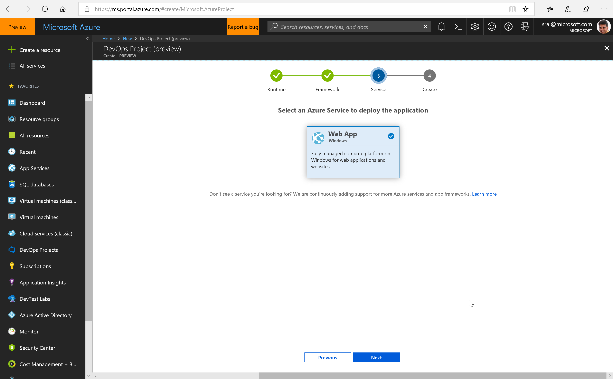

1. Finally, you will have to specify what instance of Visual Studio Team Services do you want to use. If you do not have one, you can simply select to create a brand new one. Specify a name and choose a subscription. Click done when you have completed that and bam! that's literally all you need to do.  

     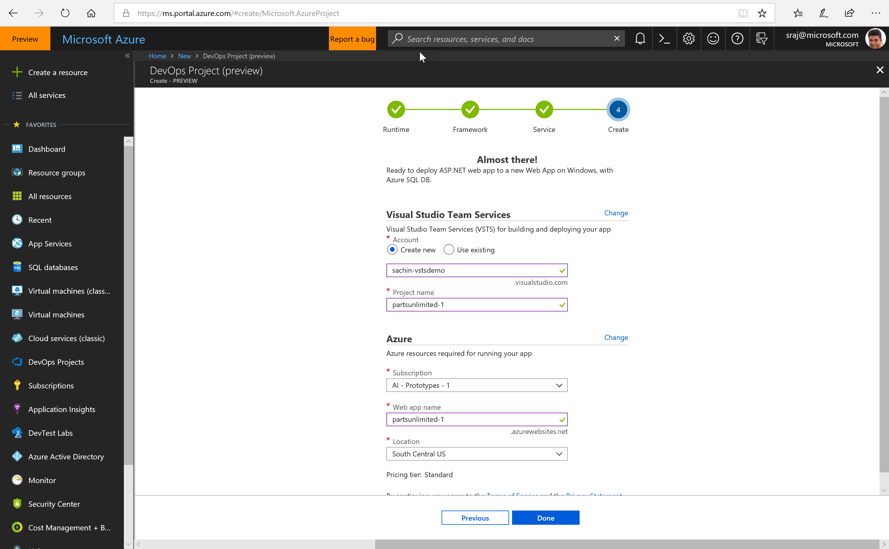

We can sit back, relax, and just let Azure build up your DevOps Projects. It's basically going to do a few things.  First, it's going to create the infrastructure up in Azure to host the sample ASP.NET app in App Service. Next, it will create a team project in Team Services, and then add sample code in a source control.  Next, it will create a CI/CD pipeline and kick off the build and the release pipeline, deploying the sample app into the infrastructure it just provisioned.

The build will download the latest code from source control. It will compile everything. It will run unit test even.  And then it will package everything up for deployment.  And if the build was successful, it will trigger release management, where release management will then download those build artifacts and deploy the artifacts into Azure. And the beauty of it all is it just does all of this in the cloud for you. There's no machines for you to build. There's no installation or configurations to do.  Everything just works. And when it's all done you get a portal that looks like this, where from one screen we can see everything that was deployed. You're able to see that we have code that’s been deployed and we have deep links as well that will take you directly into Team Services into the repository. 

   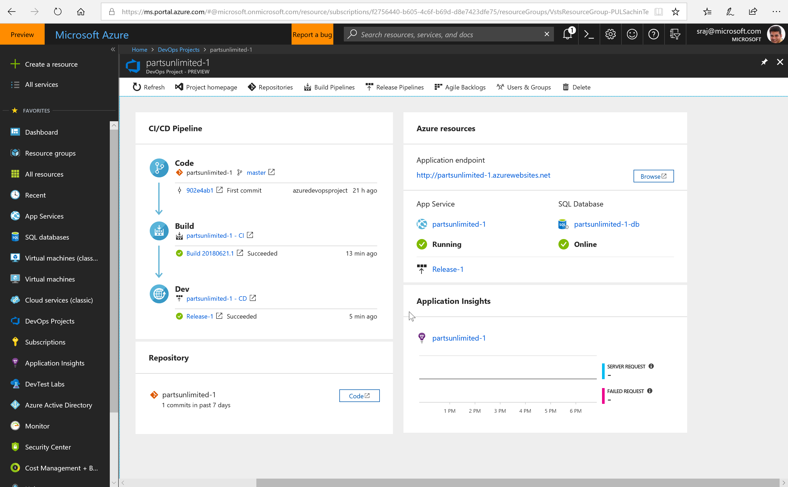

You will also see the infrastructure that has been deployed out into Azure.  So, in this case this is App Service up in Azure, as well as Application Insight has been setup and configured to monitor your application.

## Part 2: Exploring the project in-depth

 Let's take a look at the code and pipeline created in VSTS. Select the **Project HomePage** link to to open the VSTS project page. Select **Code** and you will see the repo where the sample app has been uploaded. 

 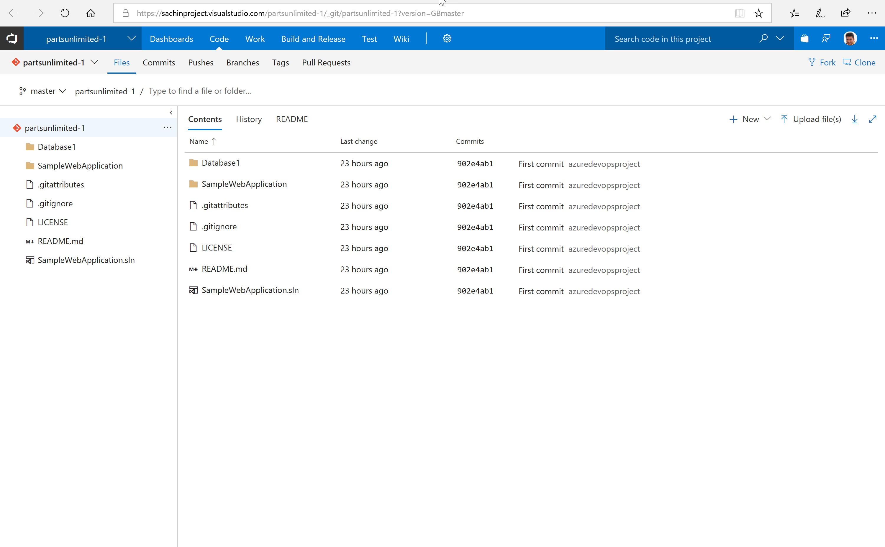
 
 1. Navigate to the build and you'll see the build def created. Click **Edit**to see what is inside the build definition. You will see the build pipeline containing tasks that makes sense for the technology that you picked. And same with release. 

    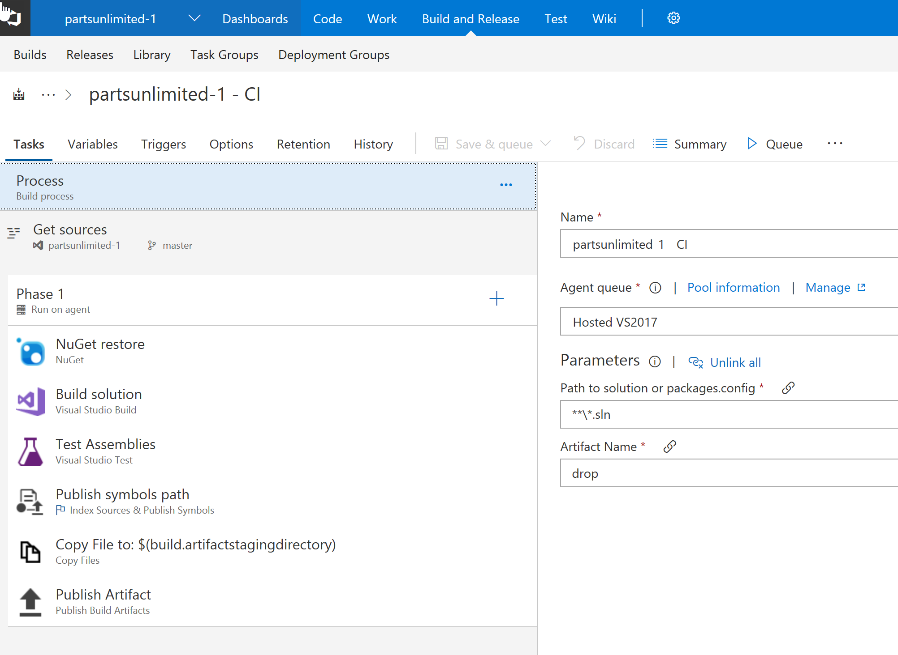
 
1. Select **Releases** from the Build tab and you will see a CD pipeline created and configured to pick the deployment artifact from the build and deploy it to the target you chose. In this case, a node app deployed to Azure app service for container. When the build and release is successful, you should be able to see the application running - [back on the Azure portal, select the application endpoint]

    Now this is great and fantastic for a sample application - But what if you wanted to customize this to deploy your code? That's actually very easy to do and let us see how you can do that.

    Go back to the code repo again. As this is a Git repo, you will need to clone the this repo to your local machine. Select **Clone** and copy the link.  Open a command line, type *git clone* and paste the text you just copied to clone the repo. And once it's done cloning, you can open an explorer window to see the cloned code. 

1. Delete the code. We will get the actual code of our application

    >**Note** The PartsUnlimited code from https://github.com/Microsoft/PartsUnlimitedE2E/ is used. You can download and extract the code from this link - https://github.com/Microsoft/PartsUnlimitedE2E/archive/dacpac.zip. 

1. Return back to the command line.  Go ahead and add everything, then commit and push your code back into VSTS. Now once the code hits VSTS, it's going to kick off a build as it is set to be a continuous integration - that is to run every time when the code is updated. 

1. Go to the VSTS poral and look at builds, you'll see that a new build has been kicked off. In most cases, the build should work without any changes but in some cases you might need to customize. Again this is very easy, select **Edit** and then you can customize by adding or removing tasks or change the properties.  Out of the box, VSTS comes with hundreds of tasks that you can just use. In addition to that, there are over 500 build and release tasks created by our partners that you can just download and start using. 

   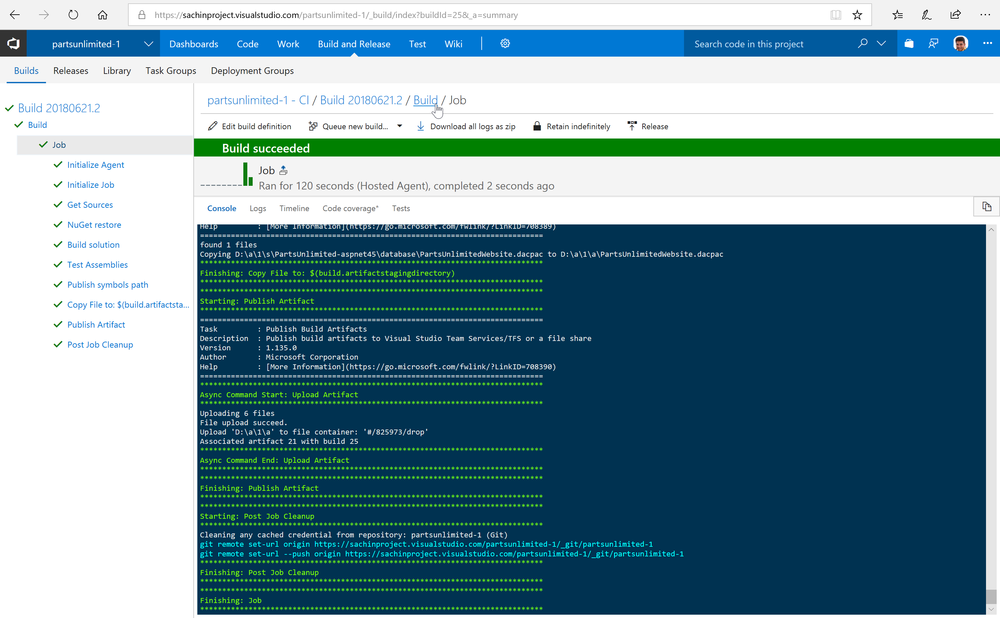
  
1. When the build is finished a release gets triggered - the release will pick up those bits and deploy the application all the way out into Azure.  Customizing the Release is very similar to customizing the build pipeline. In addition you could approvals - say for instance, you want to obtain an approval from one or more person before the deployment starts or after it is finished.

Wait for the release to finish and then go back to the app again. Select the endpoint, and you should see you code now deployed!

  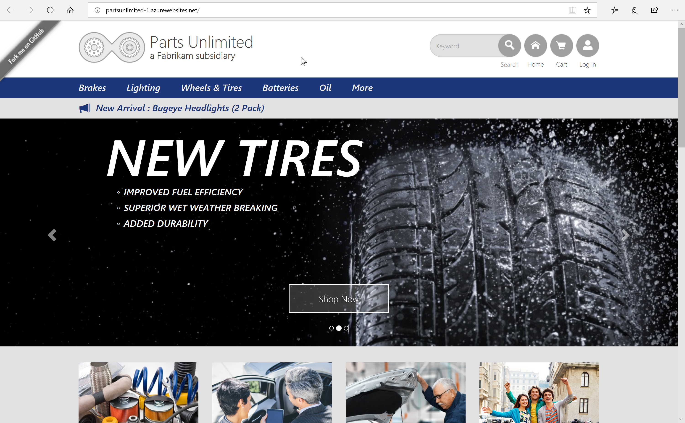

## Continuous Testing

An another important aspect of DevOps is continuous testing. Integrating and automating tests at every phase  of the lifecycle helps teams ensure high-quality, reliable software. Next in the demo, let us see how we can embed testing within both CI and CD pipelines. 

1. Let's go to **Builds** and open the build definition in edit mode. You will notice there is already a Visual Studio task - this task scans for test assemblies within a specified directory. There are several options available for us to select and control tests that we want to run. We can select to collect **code coverage** information during the run and upload the results to the server. 

An another interesting, very useful option is **Run only impacted tests** - For a given code commit entering the pipeline, only the relevant tests required to validate that commit will be selected and run. This will make tests to complete faster, if there is a failure you will get to know about it faster, and because it is all scoped by relevance, analysis will be faster as well. When selecting this option, you can specify after how many test runs we want all tests to run. 
    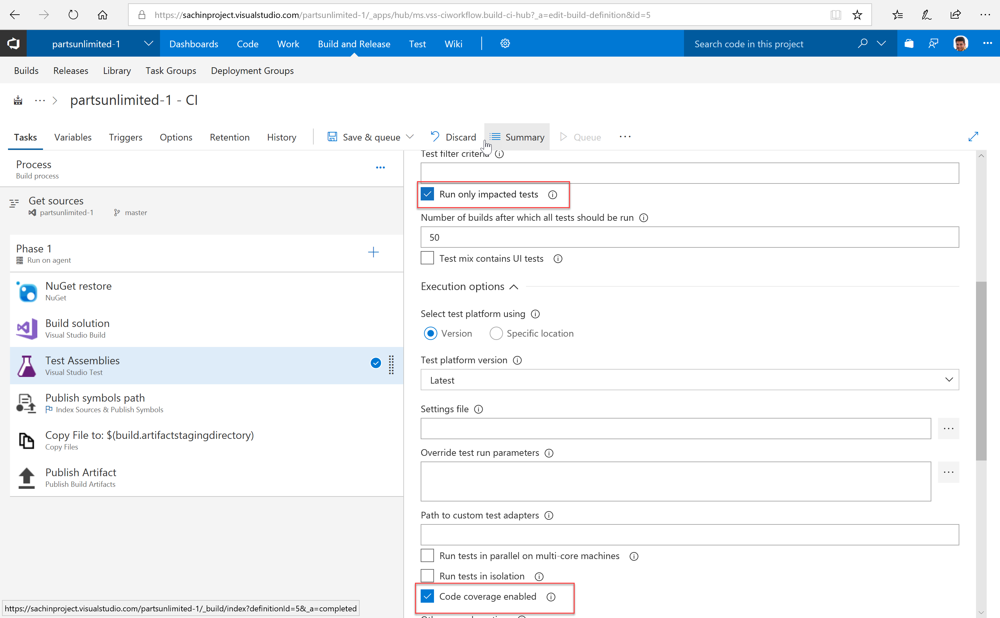

1. **Save and Queue** the build and when the build finishes, open the build run summary. You will notice the unit test cases have been executed and code coverage collected. You can drill down to the **Code Coverage** and **tests** tabs for  detailed report.
    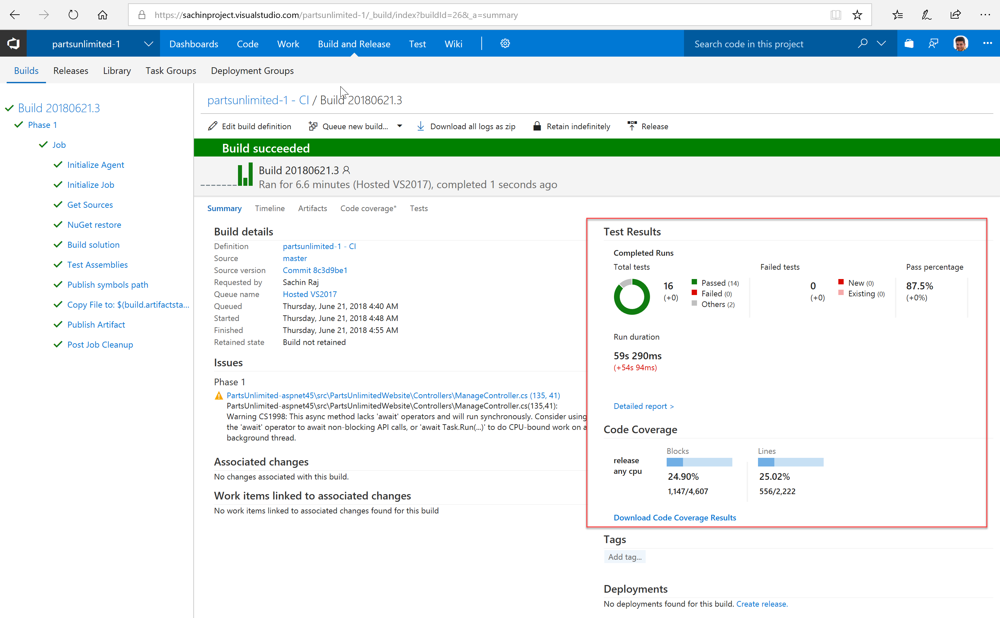

1. Similarly we can run tests in releases as well.  Open the dev phase and now like we did in the build definition, we can add testing to validate the deployment. Functional, Load and Performance tests are typically run in a release pipeline. You will find several test tasks, OOB or in marketplace available for you to use.

    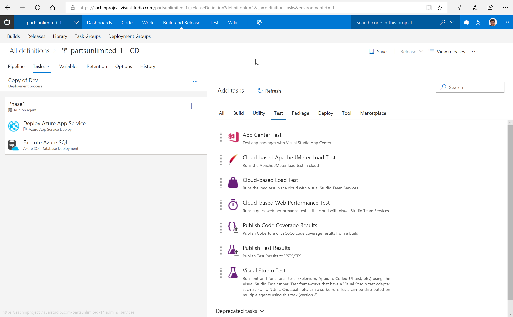

1. Now notice at this moment, we’re only releasing into one  environment called Dev, Let's say we want to deploy this into another environment (say QA, Prod for instance).  We can clone the environment and rename it. 

    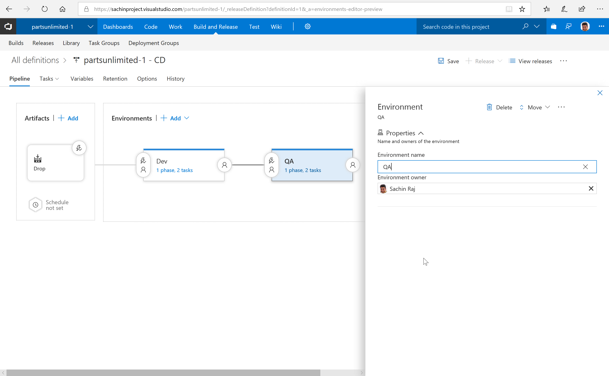

1. Now for each environment we can assign approvers and gates before and after each environment. Approvals and gates give you additional control over the start and completion of the deployment process. Each environment in a release definition can be configured with pre-deployment and post-deployment conditions that can include waiting for users to manually approve or reject deployments, and checking with other automated systems until specific conditions are verified. In addition, you can configure a manual intervention to pause the deployment process and prompt users to carry out manual tasks, then resume or reject the deployment.

    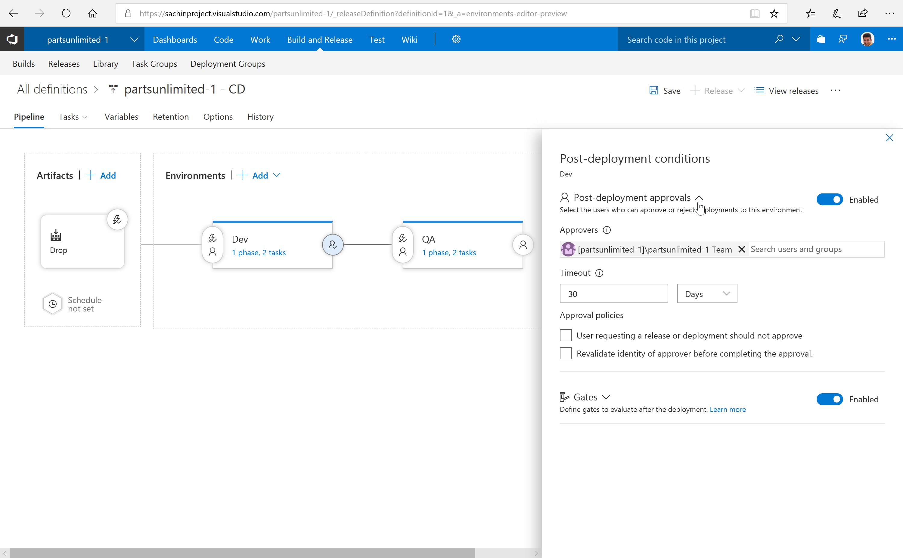

## Summary

**Azure DevOps Project** makes it incredibly easy for you to get started with scaffolding an ,  just a couple of clicks to go from nothing at all into a full end-to-end DevOps Projects. Now we are the only cloud vendor that makes it so incredibly easy to go from nothing to this full DevOps pipeline where it's ready for you just to jump in and start editing code. Now currently we support .NET, of course, Java, Node, PHP, and Python. But we have a lot more languages that are coming as well as support for VMs. Now if you want to learn more, please go to the link. http://aka.ms/devops-projects  where our docs will walk you through everything you need to know. Thank you very much.  
